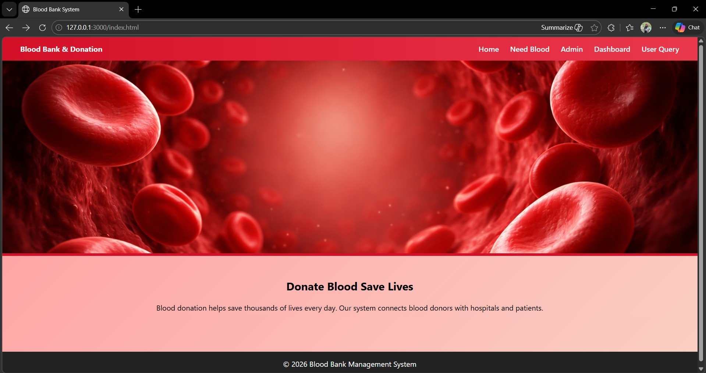
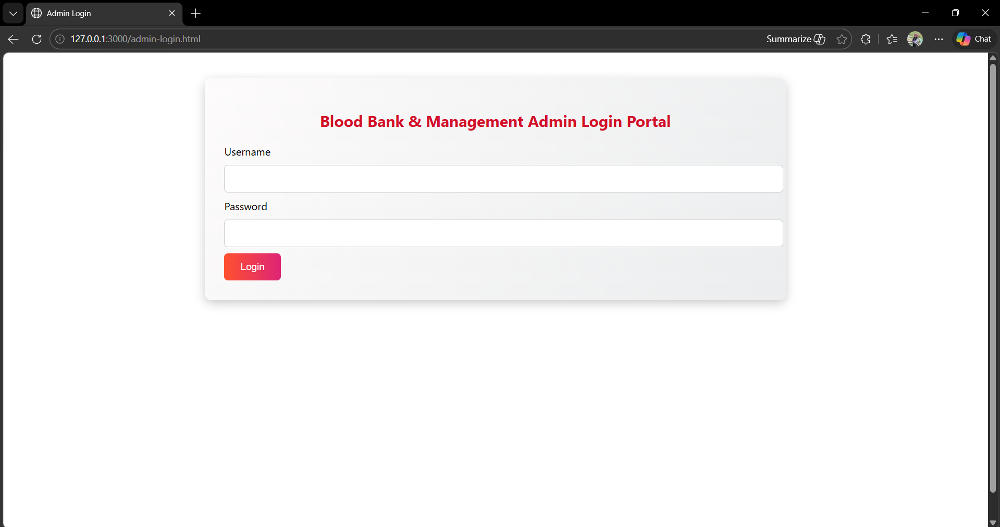
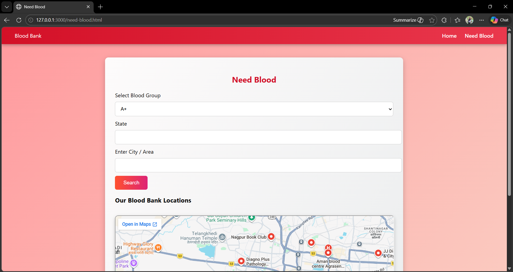
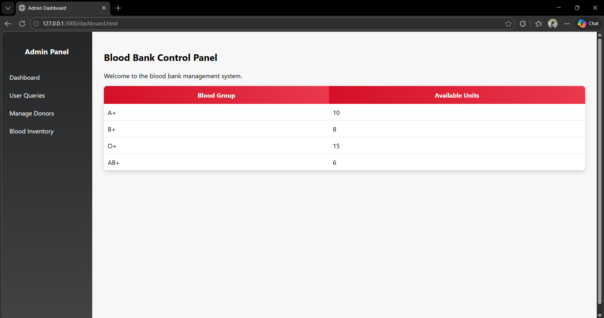
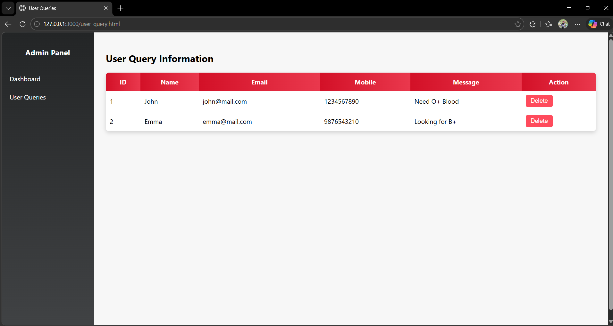

# Blood Bank & Donation Management System

## Research Paper Implementation

This project implements the user interface of a Blood Bank and Donation Management System based on the output screens presented in a research paper.

The objective of this assignment is to analyze research-based systems and recreate the HTML output interfaces using web technologies.

---
Student Name: Unnati Vihirkar.
Roll no : C-224 & DWP-77

Domain: Healthcare Information System

## Technologies Used

HTML
CSS
JavaScript

---

## Project Structure

blood-bank-management-system

index.html – Home page  
admin-login.html – Admin login portal  
need-blood.html – Search blood banks  
dashboard.html – Admin control panel  
user-query.html – User query information  

css/style.css – Styling file  
js/script.js – JavaScript functionality  

images/ – Website images  
screenshots/ – Screenshots of developed pages  

---

## Implementation Overview

### 1. Home Page
The homepage provides an overview of the Blood Bank and Donation system. It includes navigation links and an image banner representing blood donation.

### 2. Need Blood Page
This page allows users to search for blood banks by selecting blood group and location. It also displays blood bank locations using an embedded Google Map.

### 3. Admin Login Portal
The admin login interface allows administrators to enter credentials and access the management dashboard.

### 4. Control Panel (Dashboard)
The dashboard enables administrators to monitor blood inventory levels and manage system operations.

### 5. User Query Information
This page displays queries submitted by users regarding blood requirements.

---

## Features

Responsive layout design  
Navigation between multiple pages  
User-friendly interface  
Blood bank location search  
Admin dashboard interface  

---

## Screenshots

### Home Page

### Admin Login

### Need Blood Page

### Dashboard

### User Query

---

## Conclusion

This project successfully recreates the front-end interface of a Blood Bank and Donation Management System based on a research paper. The system demonstrates how web technologies can be used to design user-friendly interfaces for healthcare management applications.
# Author
Unnati Vihirkar ETC - C_224 & DWP- 77
